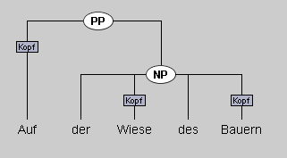
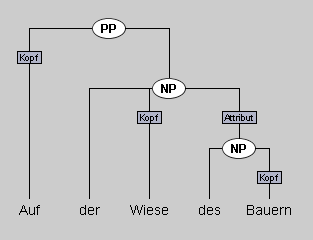
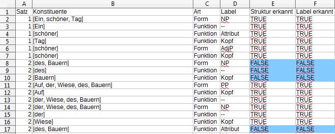
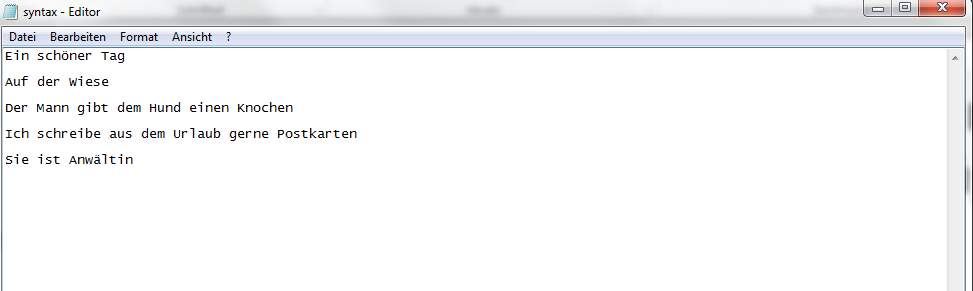
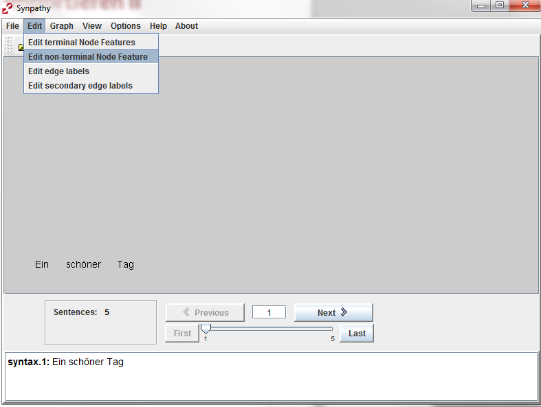
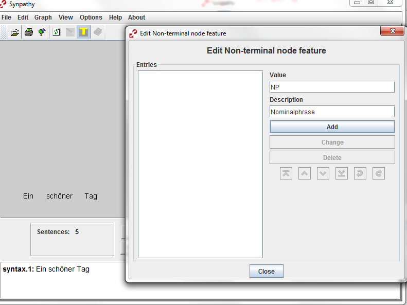
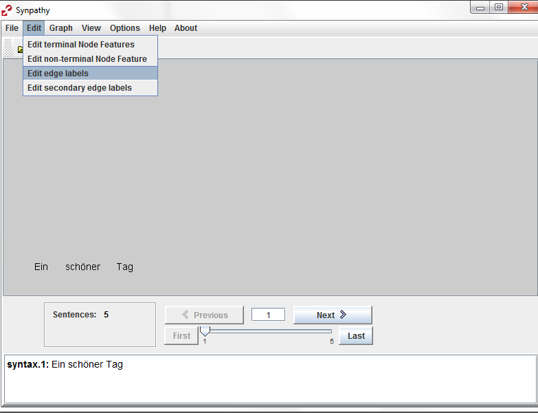
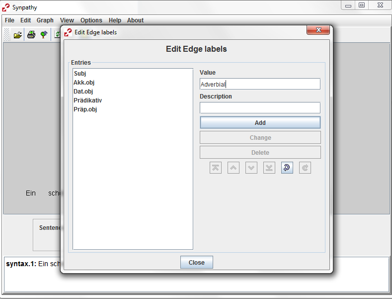

## Automatische Korrektur der Aufgaben

Für die automatische Korrektur der Aufgaben wurde Synpathy um eine Funktion
erweitert, die es erlaubt studentische Lösungen mit der Musterlösung
abzugleichen. Diese automatische Korrektur basiert auf dem Algorithmus von
Brants und Skut (1998)[^brants_skut] zum Vergleich von Syntaxbäumen. Das Ergebnis wird in
Tabellenform ausgegeben.

[^brants_skut]: Thorsten Brants & Wojciech Skut (1998): Automation of treebank annotation. In: _Proceedings of New Methods in Language Processing (NeMLaP-98)._ Sydney, Australien. [http://www.aclweb.org/anthology/W98-1207](http://www.aclweb.org/anthology/W98-1207).

1) Um die automatische Korrektur durchzuführen, erstellen Sie zuerst einen Ordner, in den Sie alle Lösungen Ihrer Studierenden legen.

2) Starten Sie Synpathy und öffnen Sie die Musterlösung, indem Sie im Menü **File** > **Open** auswählen.

3) Klicken Sie nun auf **Comparison** > **Compare with folder**.
Wählen Sie in dem erscheinenden Dialog den Ordner, den Sie im ersten Schritt erstellt haben, und klicken Sie auf **Öffnen**.

Die studentischen Lösungen werden nun mit der Musterlösung abgeglichen. Wenn das Programm fertig ist, erscheint ein Fenster mit weiteren Informationen.

Die Korrekturen werden als Tabellen im csv-Format abgespeichert. Die Tabelle enthält eine Zeile für jeden Knoten und jede Kante in der Musterlösung (s. Tabelle unten). Durch das tabellarische Format lassen sich die Daten leicht filtern und statistisch auswerten. 

- In der ersten Spalte steht die Nummer des Satzes aus der Synpathy-Datei.
- Die zweite Spalte gibt die Wörter wieder, die unter dem entsprechenden Knoten, bzw. dem Knoten zu dem die Kante führt, hängen.
- Die dritte Spalte gibt an, ob es sich um einen Knoten (_Form_) oder eine Kante
  (_Funktion_) handelt.
- Die vierte Spalte enthält das Label aus der Musterlösung.
- Die fünfte Spalte gibt an, ob in der studentischen Lösung ein äquivalenter
  Knoten/ eine äquivalente Kante existiert.
- Die sechste Spalte gibt an, ob dieser Knoten/ diese Kante das gleiche Label
  trägt wie in der Musterlösung.

Äquivalente Knoten sind dadurch definiert, dass unter ihnen die gleichen Terminalknoten (also Wörter) hängen. 
Äquivalente Kanten sind Kanten, die zwischen jeweils äquivalenten Knoten verlaufen.

### Beispiel für eine korrigierte Lösung

Die folgenden beiden Abbildungen zeigen eine studentische Lösung, die 
zugehörige Musterlösung und die durch die automatische Korrektur erzeugte Tabelle.

Die Fehler sind zur Verdeutlichung in der Tabelle blau markiert. Der Hauptfehler ist, dass nicht erkannt wurde, dass *des Bauern* eine eigenständige NP ist. Der oberste Fehler in der Tabelle bezieht sich auf das Fehlen des entsprechenden Knoten, die beiden Fehler darunter auf das Fehlen der Kanten zwischen dieser NP und den Wörtern *des* und *Bauern*. Zusätzlich fehlt die Kante, die die NP *des
Bauern* als Attribut der NP *der Wiese des Bauern* ausweist, was durch den untersten Fehler angegeben wird.

## Erstellung eigener Aufgaben

Das Erstellen einer eigenen Aufgabe in Synpathy läuft in drei Schritten ab.

- Erstellen einer Textdatei mit den zu analysierenden Sätzen
- Erstellen der Aufgabe (tig und Feature-Datei)
- Erstellen der Musterlösung

> **Hinweis**: Wie oben erläutert werden bei der automatischen Korrektur
> äquivalente Knoten in den beiden Analysen darüber identifiziert, dass sie die
> gleiche Menge an Terminalknoten umfassen. Wenn daher zwei Nicht-Terminalknoten
> existieren, die die gleichen Wörter enthalten, funktioniert der Algorithmus
> nicht. Solche strukturen können z.B. bei *mass nouns* in der X-Bar-Theorie
> auftreten, etwa [[Milch]N']N''. Wenn Sie in Ihrer Aufgabe solche Strukturen
> einbauen, also Nicht-Terminalknoten, von denen nur eine Kante ausgeht, die
> außerdem zu einem Nicht-Terminalknoten führt, können Sie die automatische
> Korrektur nicht verwenden. Sekundäre Kanten werden vom Algorithmus ebenfalls
> ignoriert.

### Erstellen einer Textdatei mit den zu analysierenden Sätzen

Im ersten Schritt erstellen Sie eine txt-Datei mit den Sätzen (oder Phrasen), die Sie analysieren lassen wollen. Hierzu nutzen Sie einen Texteditor. Unter Windows z.B. Notepad, das Sie unter
**Zubehör** > **Editor** im Start-Menü finden.

Schreiben Sie die Sätze jeweils in eine eigene Zeile und lassen Sie zwischen den Sätzen eine Zeile frei. 

> Synpathy erstellt beim Einlesen jeweils einen Terminalknoten zwischen zwei Leerzeichen. Wenn Sie Interpunktionszeichen einfügen wollen, bietet es sich daher an, diese mit einem Leerzeichen vom Wort abzutrennen, damit Synpathy hierfür einen eigenen Knoten erstellt.

### Erstellen der Aufgabe

Die Datei, die Sie im vorherigen Schritt erstellt haben, können Sie in Synpathy
laden, indem Sie im Menü **File** > **Import Terminal Nodes** auswählen und das folgende Fenster bestätigen.

Nun sind Ihre Sätze in Synpathy importiert und Sie können einfach mit **File** >
**Save** die Aufgabendatei für die Studierenden speichern.

Als nächstes müssen Sie nur noch die Kategorien, die die Studierenden zur
Analyse verwenden sollen (also z.B. Phrasentypen und syntaktische Funktionen),
angeben.

Dies machen Sie über den Reiter **Edit**. 
Dort gibt es die Möglichkeiten Labels für Knoten (**Edit non-terminal Node Feature**)....

und Labels für Kanten (**Edit edge labels**) zu erstellen und zu bearbeiten. 

### Erstellen der Musterlösung

Zum Erstellen der Musterlösung öffnen Sie die im vorigen Schritt erstellten
Dateien, erstellen die von Ihnen gewünschten Analysen und speichern die Datei
als Musterlösung ab. Die Bedienung von Synpathy ist in der [Anleitung zu Synpathy für Studierende]({{site.data.programs[page.program].student_page}}) erläutert.

> Tipp: Wenn Sie den Studierenden teilanalysierte Sätze geben möchten, erstellen Sie zuerst diese Strukturen und überschreiben Sie beim Speichern die Aufgabendatei. Danach vervollständigen Sie die Analyse für die Musterlösung.
