

<a href="{{relative-baseurl}}/index.html">Zur&uuml;ck zur &Uuml;bersicht</a>

# Bearbeitung von Phrasen und Sätzen mit Synpathy #

Nachfolgend wird erklärt, wie Sie das Programm Synpathy benutzen, um die Aufgabe
zu bearbeiten.

> **Lesehinweis**: Absätze, die wie dieser formatiert sind, enthalten Hintergrundinformationen,
> die Sie bei Interesse lesen können. Für das Lösen der Aufgabe sind diese aber
> nicht notwendig und können daher auch übersprungen werden.

## Was ist Synpathy? 

Synpathy ist ein Programm, mit dem Sätze in Form von Konstituenzbäumen annotiert
werden können. Ein einfache Satzanalyse in Synpathy könnte folgendermaßen aussehen: 

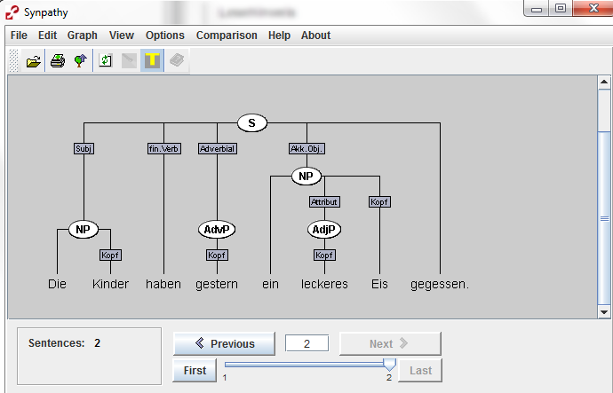

> Hintergrundwissen:  
> Synpathy speichert die analysierten Sätze im Format [TIGER-XML](http://www.ims.uni-stuttgart.de/forschung/ressourcen/werkzeuge/TIGERSearch/doc/html/TigerXML.html). Diese können dann mit Programmen wie [TIGERSearch](http://www.ims.uni-stuttgart.de/forschung/ressourcen/werkzeuge/tigersearch.html) oder [ANNIS](http://corpus-tools.org/annis/) durchsucht werden.
> So könnten Sie z.B. Zeitungstexte mit Synpathy annotieren und am Ende Fragen beantworten wie: "Welche Arten von Attributen kommen in Nominalphrasen vor?" oder "Wieviele Elemente enthält die Verbalklammer im Durchschnitt?".

## Installation von Synpathy

Synpathy benötigt keine Installation im üblichen Sinne. Wenn auf Ihrem Rechner
eine aktuelle Version von Java installiert ist -- was üblicherweise der Fall ist --,
reicht es, wenn Sie die aktuelle Version von Synpathy [herunterladen]({{relative-baseurl}}{{site.data.programs[page.program].download_url}})
und entpacken. Im entpackten Ordner finden Sie dann eine Datei synpathy.jar, die sie mit einem
Doppelklick ausführen können.

**Wichtig:** Achten Sie darauf, dass Sie die Datei entpacken. Unter Windows
lassen sich zip-Dateien wie Ordner öffnen, sind dann aber nicht entpackt. Sie
erkennen dies daran, dass in der Kopfleiste die Option "Alle Dateien extrahieren"
angezeigt wird.

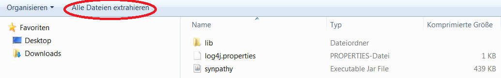

Eine Möglichkeit die Datei zu entpacken ist es, auf diese Schaltfläche zu
klicken. Alternativ können Sie einen Rechtsklick auf die
zip-Datei machen und im Kontextmenü "Alle extrahieren ..." auswählen.

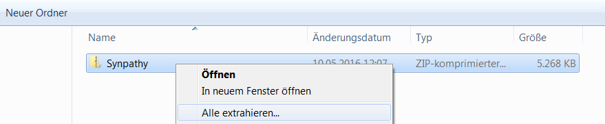

Bitte merken Sie sich, in welchen Ordner Sie die Datei extrahieren und
führen Sie die Datei synpathy.jar von dort aus.

Sollte Synpathy trotzdem nicht funktionieren, liegt dies vermutlich an Java. Versuchen
Sie in diesem Fall eine aktuelle Version von Java herunterzuladen
([https://www.java.com/de/download/](https://www.java.com/de/download/)) und zu
installieren. 

## Öffnen der Aufgabendatei

Wenn Sie Synpathy gestartet haben, müssen Sie zunächst die Aufgabendatei öffnen.
Klicken Sie hierzu auf **File** > **Open** und wählen Sie im folgenden Dialog die
entsprechende Datei aus (Endung: tig).

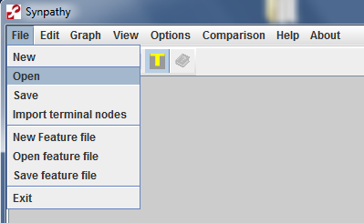

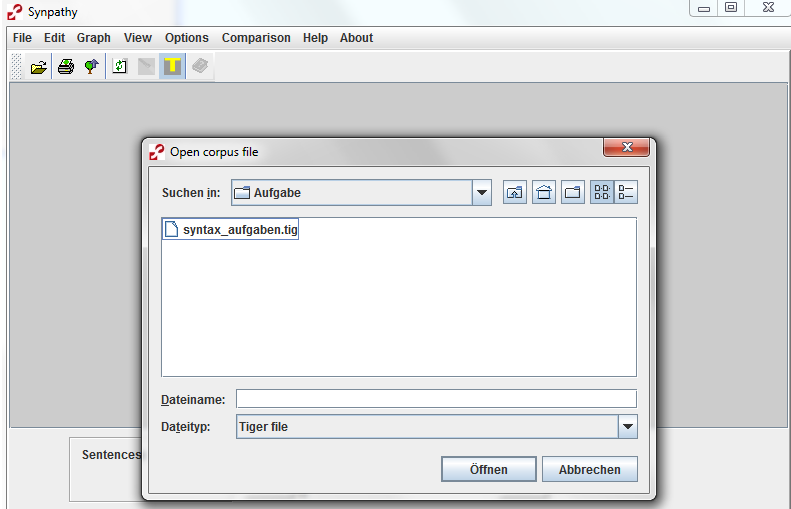

## Öffnen der Feature-Datei

Zum Bearbeiten der Aufgabe müssen Sie noch eine Feature-Datei öffnen.

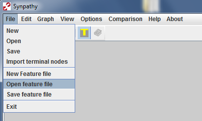

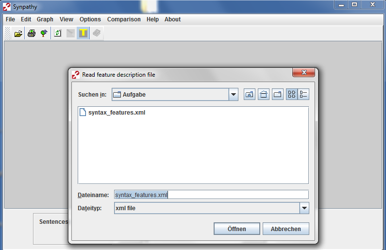

>  **Was sind Features?** Synpathy gibt nur sehr formale Grundkategorien vor, mit denen sie Sätze annotieren können (s. nächsten Abschnitt). Ob eine Nominalphrase nun als "NP" oder "Nominalphrase" bezeichnet werden soll, kann frei gewählt werden (auch, ob überhaupt Nominalphrasen annotiert werden sollen). Daher ist es notwendig Synpathy mitzuteilen, welche Bezeichnungen vergeben werden dürfen. Dies geschieht über sogenannte Features. Im Menü **Edit** könnten Sie die Features bearbeiten. Für die Bearbeitung der Aufgabe hat Ihre Dozentin/ Ihr Dozent bereits festgelegt, mit welchen Kategorien sie arbeiten sollen und dies in der beigelegten Feature-Datei gespeichert. Sie müssen diese also nur (wie oben angegeben) öffnen und können dann mit der Annotation beginnen. 

## Speichern

Ihr Dozent/ Ihre Dozentin bekommt die Lösungsdateien für den gesamten Kurs. Damit die einzelnen Dateien möglichst eindeutige Namen haben, wählen Sie beim Speichern bitte als Dateinamen "Nachname_Vorname.tig". Gehen Sie hierzu auf den Reiter **File** und klicken Sie dann auf **Save**. 

Die gespeicherten tig-Datei lassen Sie bitte Ihrem Dozenten/ Ihrer Dozentin auf dem vereinbarten Wege zukommen, damit diese/r die automatische Auswertung durchführen kann. 

## Satzannotation in Synpathy

Synpathy ist ein Programm, mit dem Sätze annotiert werden können. Dabei arbeitet
Synpathy mit Bäumen wie in der folgenden Abbildung:

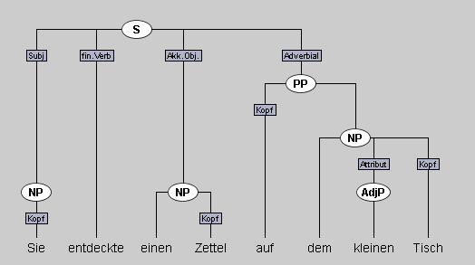

Eine Annotation in Synpathy besteht aus den folgenden Elementen:

- den **Terminal-Knoten**
	- Dies sind die Wörter, aus denen der Satz (oder die Phrase) besteht.
	- Sie werden am unteren Rand angezeigt.  
- den **Nicht-terminal Knoten**
	- Sie werden als Ovale über den Wörtern angezeigt. 
	- Sie werden dazu verwendet, um andere Knoten zu gruppieren;  
    so können z.B. Phrasen durch Knoten dargestellt werden.
- den **Kanten**  
    - Kanten sind die Linien, die Knoten miteinander verbinden. 
    - Sie sind von oben nach unten zu lesen ("enthält")
- den **Labels**
	- Sowohl Kanten als auch Knoten können benannt werden, also ein Label erhalten. 
	- Labels von Kanten stehen in Vierecken (z.B. Subj); die Labels der Knoten erscheinen im Oval (z.B. NP). 

Im Folgenden wird beispielhaft die Annotation eines Satzes durchgespielt. Wenn
Sie die einzelnen Schritte selbst nachvollziehen wollen, können Sie dies mit
Hilfe der Beispiele
in [beispiel-zettel.tig]({{relative-baseurl}}{{site.data.programs[page.program].base_url}}Beispieldateien/beispiel-zettel.tig) und der Features
in [syntax_features.xml]({{relative-baseurl}}{{site.data.programs[page.program].base_url}}Beispieldateien/syntax_features.xml) tun. Zum Öffnen
mit Synpathy speichern Sie die Dateien daher am besten an einem Ort ab, den sie
leicht wiederfinden, z.B. auf dem Desktop. Das Abspeichern funktioniert mit
einem Rechtsklick auf den Link und dann "Ziel speichern unter" bzw. "Link
speichern unter". Wie Sie die Dateien dann mit Synpathy öffnen, ist oben
beschrieben.

### Knoten erstellen

Die Satzannotation beginnt überlicherweise damit, dass Sie nur die Wörter
(Terminalknoten) haben.

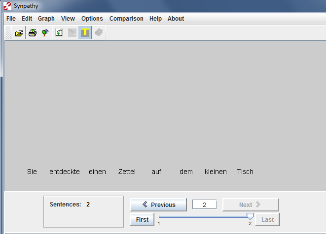

Ihre Analyse beginnt nun damit, dass Sie zusammengehörige Wörter auswählen und
mit einem Knoten zusammenfassen. Halten Sie hierzu STRG gedrückt und klicken Sie
mit der linken Maustaste auf die Wörter, die sie zusammenfassen wollen. Die
markierten Wörter sind nun farbig (siehe die dunkelblauen Wörter im unteren
Bild). Klicken Sie anschließen mit der rechten Maustaste auf eines der
ausgewählten Wörter. Im nun erscheinenden Kontextmenü wählen Sie **Add parent
node**. Man kann natürlich auch nur ein Wort anklicken und für dieses einen
Knoten erstellen, z.B. wenn Sie eine Phrase auszeichnen wollen, die nur aus
einem Pronomen besteht.
 
 
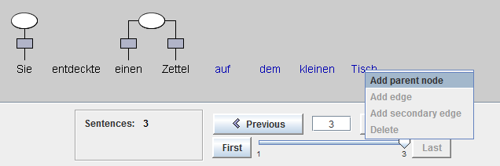

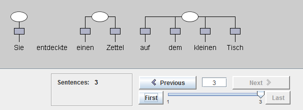

Die Knoten kann man dann (gemeinsam mit einem oder mehreren Wörtern, im Beispiel
dem finiten Verb) erneut mit einem Knoten zusammenfassen, indem man die Knoten
und die entsprechenden Wörter markiert.
 
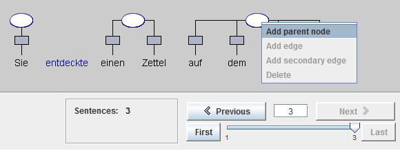

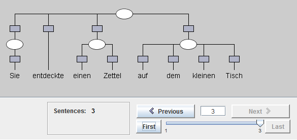

Sie können auch unter existieren Knoten zusammenfassen. Im Beispiel können Sie
die in die Präpositionalphrase eingebettete Nominalphrase hinzufügen...

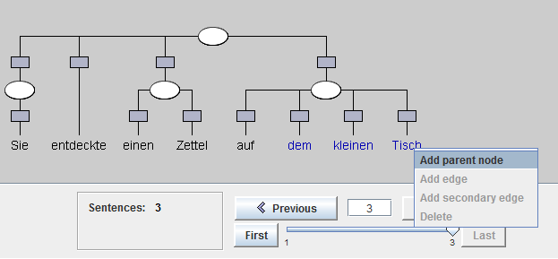

... und die in die Nominalphrase eingebettet Adjektivphrase. 

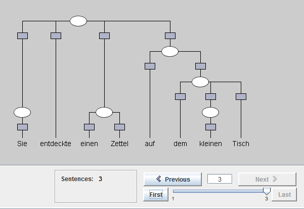

### Knoten und Kanten beschriften

Jetzt fehlt noch die Beschriftung. Hiezu macht man ein Doppelklick auf den Knoten oder die Kante und wählt dann das entsprechende Label aus. 

> Wenn dieser Schritt nicht funktioniert, liegt dies evtl. daran, dass die
> Feature-Datei mit den Labels (s. Beschreibung oben) nicht geladen wurde. 

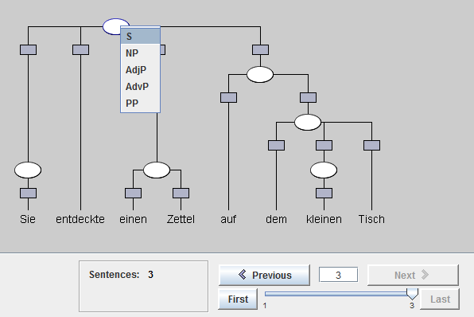

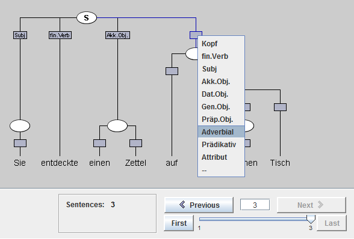

Mit der Auswahl des Labels "\-\-" kann man Kanten, die unbeschriftet bleiben sollen, ausblenden. 

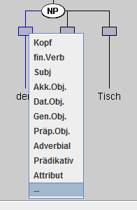 wird zu  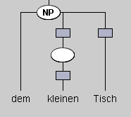

Das fertige Resultat sieht so aus: 

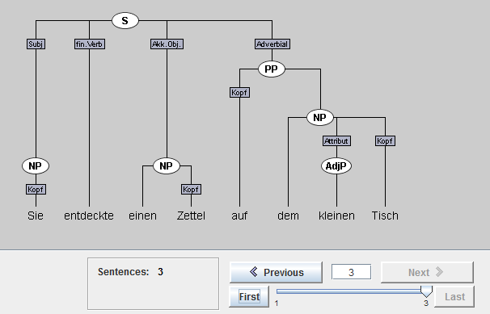

Wenn man sich mal verklickt, dann kann man Knoten und Kanten ganz leicht löschen: Knoten oder Kante mit einem Klick markieren und dann: **Rechtsklick** > **Delete** 
 
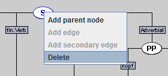

## Tipps zur Benutzung

### Farben ändern

Wörter, die man in Synpathy anklickt werden in der Standardeinstellung dunkelblau markiert. Da diese Farbe nur schwer zu erkennen ist, empfehlen wir, sie zu ändern. Hierfür klickt man im Menü oben auf **Options** > **Color options**

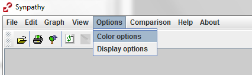

Es öffnet sich ein Farbmenü. Hier kann man die Farbe **Node Highlighted Color** z.B. in rot ändern. 

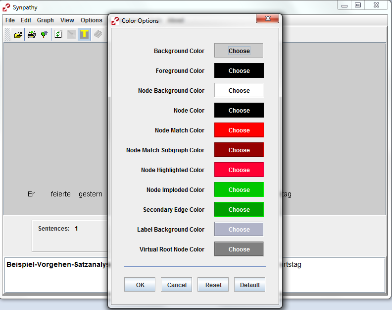

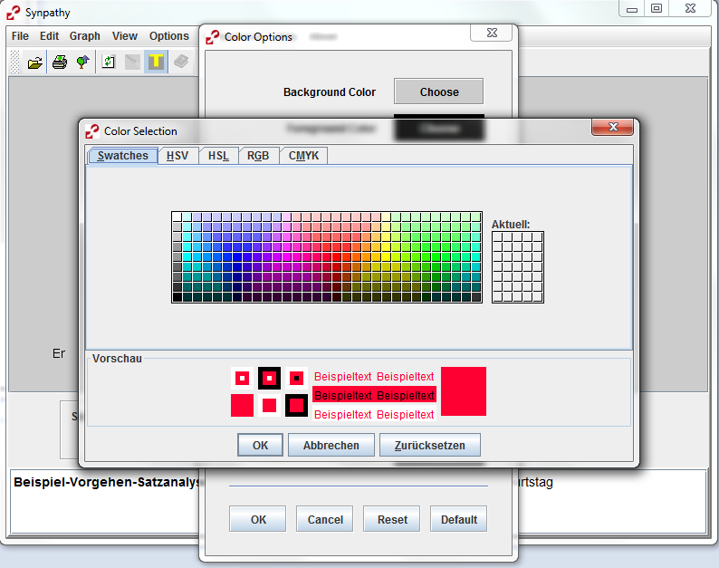

## Wörter (nicht) ändern

Synpathy erlaubt es Wörter (Terminalknoten) zu bearbeiten.
Wenn Sie mit der Maus einen Doppelklick links machen, erscheint ein Fenster, in
dem Sie das Wort ändern können. 
**Wichtig:** Tun Sie dies nicht, da das Auswertungsprogramm dadurch den ganzen
Satz als falsch werten würde.

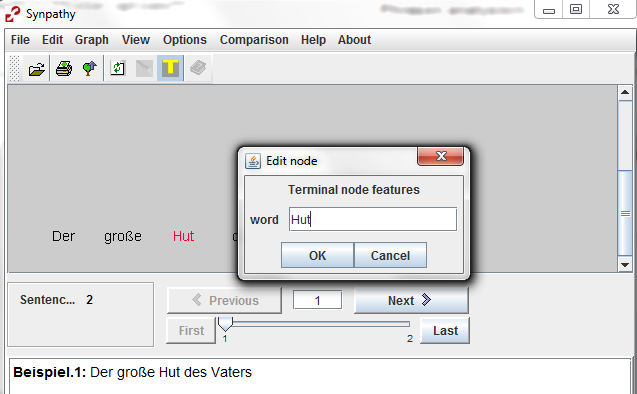

