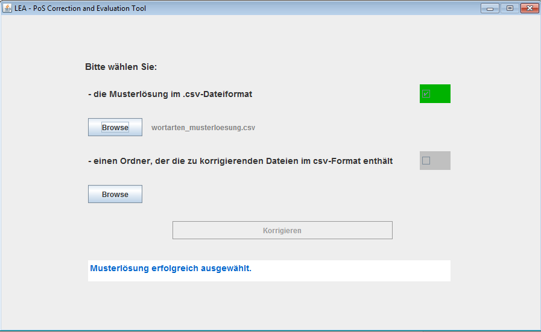
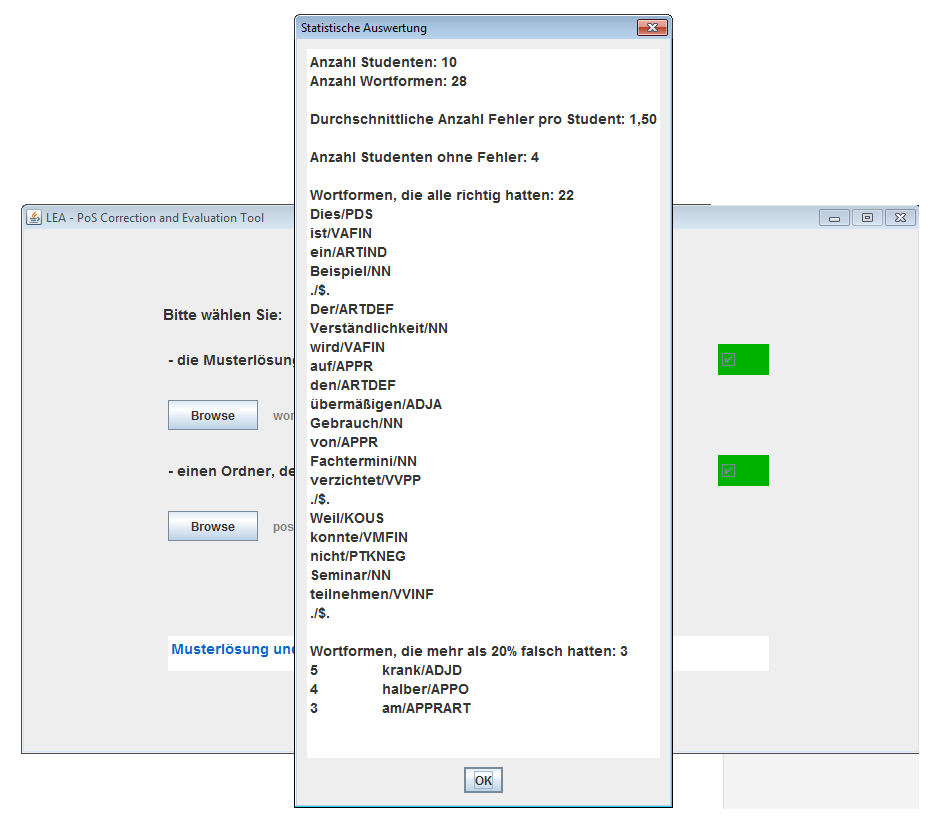
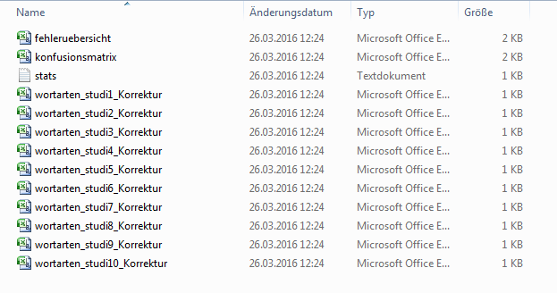
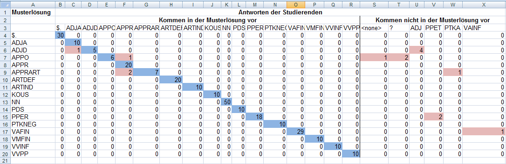
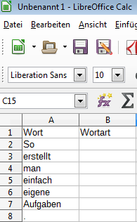
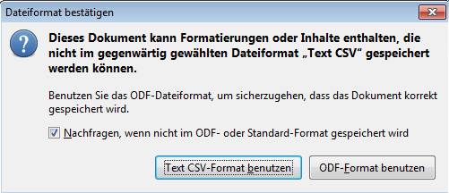
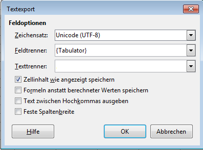



## Automatische Korrektur der Aufgaben

Die automatische Korrektur der Aufgaben können Sie mit dem Programm ["{{site.data.programs[page.program].correction_tool.name}}"]({{relative-baseurl}}{{site.data.programs[page.program].correction_tool.url}}) durchführen.
Es handelt sich um ein Java-Programm, das keine
Installation benötigt. Wenn Sie auf Ihrem Rechner eine aktuelle Version von Java
installiert haben -- was üblicherweise der Fall ist --, können Sie das Programm durch
einen Doppelklick auf die heruntergeladen Datei _lea_poscorr.jar_ starten. Sollte das Programm nicht
starten, liegt dies vermutlich an Java. Versuchen Sie in diesem Fall Java
herunterzuladen
[https://www.java.com/de/download/](https://www.java.com/de/download/) und zu
installieren.

Das Programm für die Korrektur und Auswertung der Aufgaben benötigt folgende
Eingaben:

1. die Musterlösung, mit der die studentischen Lösungen abgeglichen werden
2. einen Ordner, in dem die studentischen Lösungen liegen

Bevor Sie mit der Auswertung beginnen, müssen Sie einen Ordner anlegen,
in dem Sie alle Lösungen der Studierenden ablegen.

Nach dem Start des Programms erscheint ein Fenster, das Sie auffordert, die nötigen Dateien
auszuwählen.

Wählen Sie zunächst die **Musterlösung** aus. Das Programm prüft, ob es sich
bei der angegeben Datei um eine gültige Musterlösung handelt, also ob es eine
csv-Datei ist, die die zwei Spalten "Wort" und "Wortart" enthält. Wenn dies der
Fall ist, erscheint ein grünes Häkchen im benachbarten Feld. 

Als nächstes müssen Sie den **Ordner** auswählen, der die Lösungen der Studierenden
enthält. Auch hier sollte nun das grüne Häkchen erscheinen.

Nachdem Sie die Datei und den Ordner erfolgreich ausgewählt haben, klicken Sie
auf **Korrigieren**. Das Programm gleicht nun alle csv-Dateien in dem ausgewählten
Ordner mit der Musterlösung ab. Nach einem kurzen Augenblick erhalten Sie einen
Überblick über die Ergebnisse. So können Sie auf einen Blick sehen, welche
Wortformen alle Studierenden richtig hatten und welche besonders häufig falsch
annotiert wurden.

Wenn Sie anschließend auf **Ok** klicken, erstellt das Programm im Ordner mit den
studentischen Lösungen einen Unterordner "LEA\_correction" und speichert dort
die Ergebnisse des Abgleichs. Hierzu gehören die eben angezeigten Statistiken
(_stats.txt_) und Korrekturen der einzelnen studentischen Lösugenen (jeweils der
Dateiname der studentischen Lösung mit dem Zusatz _\_Korrektur_).

Für weitere Auswertungen finden Sie hier eine Konfusionsmatrix und eine
Fehlerübersicht, die in den nächsten beiden Abschnitten beschrieben werden.
Beide liegen -- wie die Aufgabe -- als csv-Dateien vor. Mehr Informationen zu
csv-Dateien und wie Sie diese in einem Tabellenkalkulationsprogramm öffnen und
bearbeiten können, finden Sie in der [Anleitung für Studierende]({{site.data.programs[page.program].student_page}}).

### Erklärung zur Fehlerübersicht

Die Fehlerübersicht zeigt Ihnen auf einen Blick an, welche Wortformen wie von den
Studierenden analysiert wurden.

Wie die Musterlösung enthalten die ersten beiden Spalten das jeweilig Wort und den richten Wortarten-Tag. Die folgenden Spalten enthalten jeweils die Information, wie häufig dieses Wort
richtig und wie häufig es falsch analysiert wurde. Damit können Sie auf einen
Blick identifizieren, bei welchen Wörtern es Probleme gab.
Über die folgenden Spalten können Sie sich ein genaueres Bild von den Fehlern
machen.
Jede Spalte steht für einen Wortartentag. Die Zahl in dieser Spalte gibt an, wie
häufig dieser Tag für die entsprechende Wortform vergeben wurde.

Ein Beispiel: Die Aufgabe wurde von 10 Studierenden bearbeitet. Sie enthält die
beiden Wortformen "am" und "Sonntag". Sonntag haben alle Studierenden als
einfaches Substantiv erkannt ("NN"), "am" haben drei Studierenden als einfache
Präposition ("APPR") analysiert und nicht erkannt, dass es sich um eine
Präposition-Artikel-Klise handelt ("APPRART" nach STTS). Dies zeigt der
folgenden Aussschnitt aus der Fehlerübersicht:

<table>
<tr>
<td> Wort    </td>
<td> Wortart </td>
<td> Richtig </td>
<td> Falsch </td>
<td> ... </td>
<td> APPR </td>
<td> APPRART </td>
<td> ... </td>
<td> NN </td>
<td> ... </td>
</tr><tr>
<td> ... </td><td></td><td></td><td></td><td></td><td></td><td></td><td></td><td></td><td></td>
</tr><tr>
<td> am      </td>
<td> APPRART </td>
<td> 7 </td>
<td> 3 </td>
<td> 0 </td>
<td> 7 </td>
<td> 3 </td>
<td> 0 </td>
<td> 0 </td>
<td> 0 </td>
</tr><tr>
<td> Sonntag </td>
<td> NN      </td>
<td> 10 </td>
<td> 0 </td>
<td> 0 </td>
<td> 0 </td>
<td> 0 </td>
<td> 0 </td>
<td> 10 </td>
<td> 0 </td>
</tr>
</table>

### Erklärungen zur Konfusionsmatrix

Die Konfusionsmatrix führt die Informationen aus der Fehlerübersicht weiter. Wie
die Fehlerübersicht stehen die Spalten für Wortartentags, die die Studierenden
vergeben haben. In den Zeilen stehen jetzt aber nicht mehr die konkreten
Wortformen, sondern direkt die Wortartentags. Die Zeile "APPRART" sammelt damit
die Antworten für alle Wörter mit der Wortart "APPRART".
Damit sieht man gut, welche Wortarten keine Probleme bereiten und welche häufig
verwechselt werden.

Das folgende Bild enthält ein Beispiel für eine Konfusionsmatrix. Zur besseren
Übersichtlichkeit sind hier Überschriften hinzugefügt und wichtige Felder
farblich hervorgehoben.

Ein wichtiger Anhaltspunkt ist hierbei die Diagonale (blau eingefärbt):  
Da die Wortarten aus der Musterlösung und aus den Lösungen der Studierenden in
der gleichen Reihenfolge angeordnet sind, enthält die Diagonale die Fälle, in
der Musterlösung und Antwort übereinstimmen. Im Beispiel wurden alle 
definiten Artikeln (ARTDEF) von allen Studierenden richtig klassifiziert. Die
Zahl 20 ergibt sich aus der Anzahl der definiten Artikel in der Aufgabe (2) und
der Anzahl der Studierenden (10). Diese Wortart
bereitet den Studierenden also keine Probleme. Anders sieht es bei der einen
Postposition (APPO) in der Aufgabe aus. Diese wurde von 6 Studierenden richtig
erkannt. Die restlichen 4 Studierenden haben jeweils einen Fehler gemacht.
Felder, die Fehler anzeigen, sind im Beispiel rot eingefärbt. Es sind alle
Zellen, die nicht auf der Diagonale liegen und nicht 0 enthalten.
Einmal wurde die Postposition als Präposition (APPR) bestimmt. Die anderen drei
Studierenden waren sich nicht sicher, worum es sich bei dem entsprechenden Wort handelt.
Einmal wurde das entsprechende Feld freigelassen ("\<none\  >") und zweimal wurde
ein "?" eingefügt.

Da freigelassene Felder oder "?" nicht in der Musterlösung existieren, enthält
die Tabelle mehr Spalten als Zeilen. Alle Wortartentags, die nicht in der
Musterlösung vorkommen, sind nach hinten sortiert, da sie ansonsten die
Diagonale unterbrechen würden. Zusätzliche Tags können wie im Beispiel durch
nicht ausgefüllte Felder entstehen, das Verwenden eines Tags, der nicht
abgefragt wurde, oder auch durch Tippfehler.

## Erstellung eigener Aufgaben

Sie können neben den mitgelieferten Aufgaben auch eigene Aufgaben erstellen, die
von den Studierenden mit einem Tabellenkalkulationsprogramm bearbeitet werden,
und die Sie wie oben beschrieben automatisch korrigieren und auswerten können.
Wir empfehlen Ihnen das Tabellenkalkulationsprogramm LibreOffice Calc.

### Erstellen der Aufgabe

Das Auswertungsprogramm erwartet die Lösungen und die Musterlösung in
einer zweispaltigen Tabelle, wobei die erste Spalte die einzelnen
Wörter und die zweite Spalte die jeweilige Wortart enthält. In der
ersten Zeile erwartet das Programm die Überschriften "Wort" und in der zweiten Spalte die Überschrift
"Wortart".

Zur Erstellung einer solchen Tabelle öffnen Sie Calc und erstellen ein leeres
Tabellenblatt. Schreiben Sie die Überschriften in die ersten beiden Spalten der
ersten Zeile. Nun können Sie einfach untereinander die Wörter schreiben, deren
Wortart bestimmt werden soll. 

Wenn Sie dies gemacht haben, speichern Sie die
Tabelle im csv-Format ab. Wählen Sie dazu **Speichern unter** und den Dateityp
"Text CSV" aus. Wenn Sie nun auf **speichern** klicken, erscheint ein Fenster
zur Bestätigung des Dateiformates. Bestätigen Sie hier, dass das csv-Format
benutzt werden soll. 

Im nächsten Fenster müssen Sie die Details zu Ihrer csv-Datei festlegen.
Das Auswertungsprogramm erwartet dabei bestimmte Einstellungen, die Sie
dem folgenden Screenshot entnehmen können.

Das Feld "Texttrenner" müssen Sie leeren. Klicken Sie hierzu in das Textfeld und löschen Sie den Text.

> Hinweis:  
> Details zur Bedeutung der einzelnen Einstellungen finden Sie in der [Anleitung
> für Studierende](studierende-anleitung-csv.html).

Die entstandene csv-Datei ist die Aufgabendatei, die Sie an Ihre
Studierenden weitergeben.

### Erstellen der Musterlösung

Haben Sie Ihre Aufgabe gespeichert, können Sie anschließend die
Musterlösung erstellen. Hierzu tragen Sie einfach die Wortarten in die
rechte Spalte ein. Achten Sie darauf, dass das Auswertungsprogramm den
Inhalt der zweiten Spalte in der Musterlösung mit den studentischen
Lösungen strikt abgleicht, d.h. wenn ein Studierender für "Haus" ein "Substantiv" annotiert, aber in der Musterlösung ein "Subst" steht, wird dies vom Programm als Fehler gewertet. Vergeben Sie daher
einheitliche Bezeichnungen, die Sie den Studierenden mitteilen. Es bietet sich an, dass Sie sich an gängigen Tagsets für die Wortartenauszeichnung orientieren (z.B. das
Stuttgart-Tübingen Tagset). 

Um die Musterlösung zu speichern wählen Sie **Speichern unter** und gehen 
wie oben beschrieben vor.  

Nun haben Sie zwei Dateien. Zum einen die Aufgabe, die Sie Ihren
Studierenden zusenden können, zum anderen die Musterlösung, mit deren
Hilfe das Programm die Ergebnisse der Studierenden auswertet.
