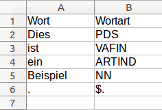
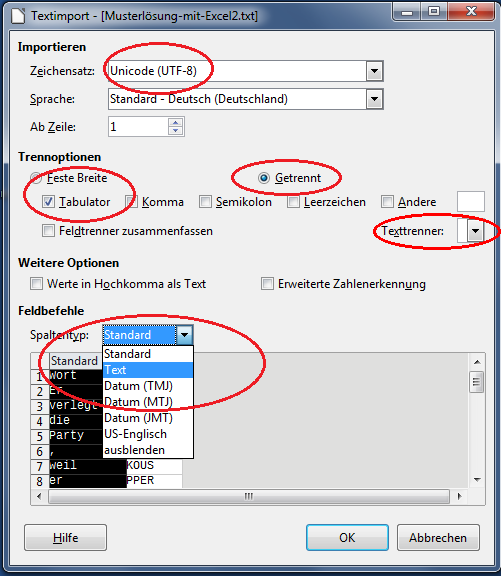
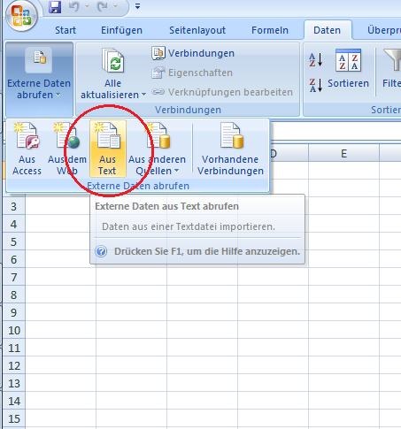
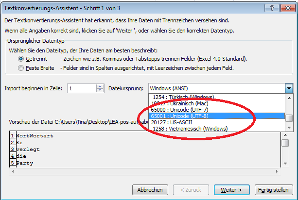
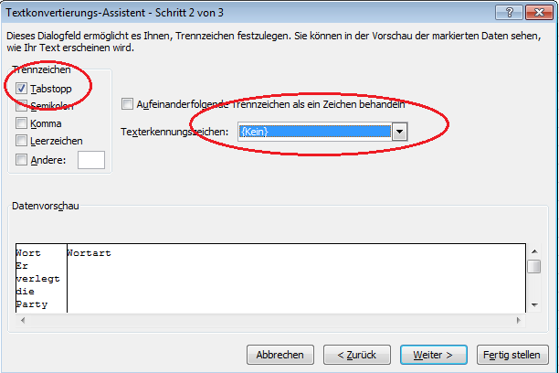
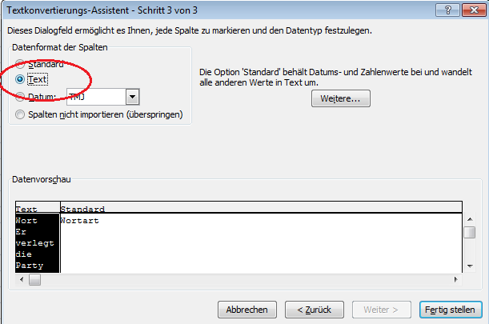
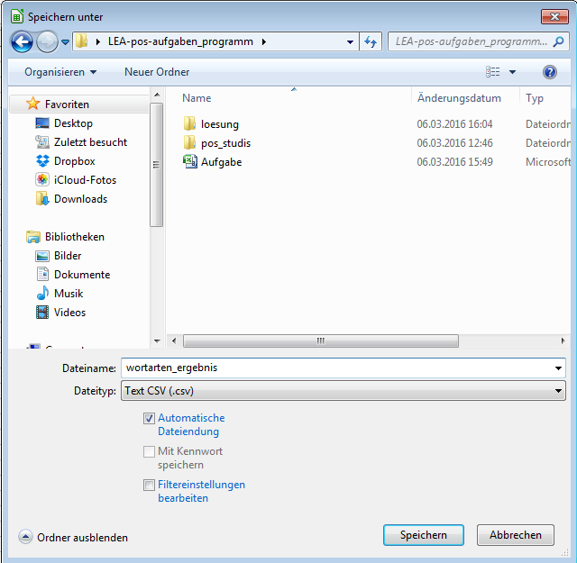
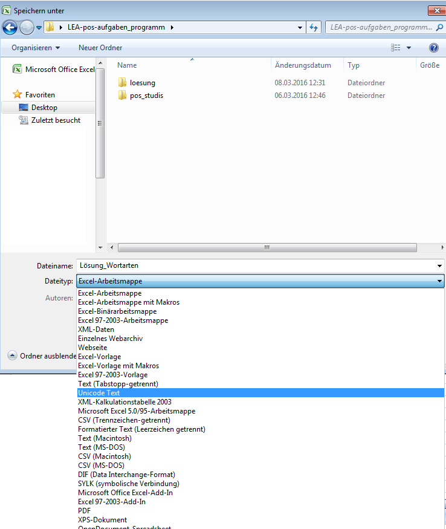
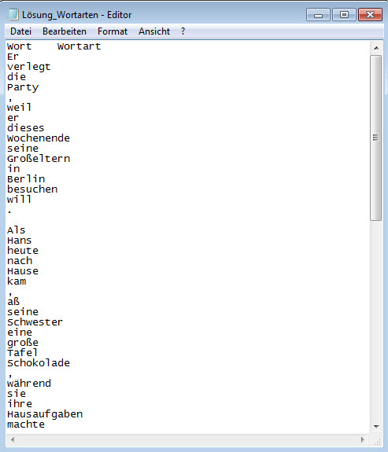
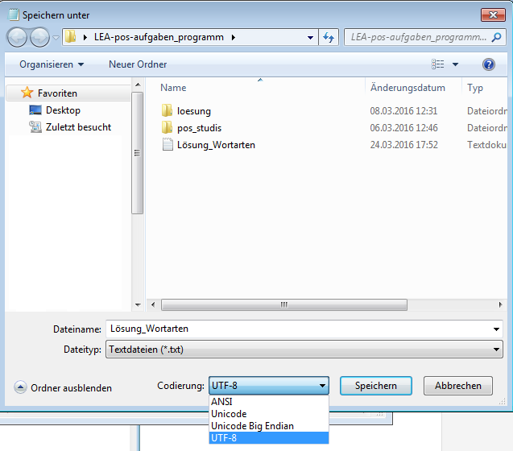



<a href="{{relative-baseurl}}/index.html">Zur&uuml;ck zur &Uuml;bersicht</a>

# Bearbeiten von Tabellen im csv-Format

Nachfolgend wird erklärt, wie Sie csv-Dateien mit Tabellenkalkulationsprogrammen bearbeiten.

> **Lesehinweis**: Absätze, die wie dieser formatiert sind, enthalten Hintergrundinformationen,
> die Sie bei Interesse lesen können. Für das Lösen der Aufgabe sind diese aber
> nicht notwendig und können daher auch übersprungen werden.

## Annotationen in Tabellen

Informationen wie Wortarten (in der Korpuslinguistik auch PoS von *part of speech*,
engl. für Wortart), die sich auf einzelne Wörter (in der Korpuslinguistik auch
*Token* genannt) beziehen, werden üblicherweise in Form von Tabellen festgehalten.
Dabei belegt jedes Wort mit seinen hinzugefügten Information (den
Annotationen) eine Zeile. In der ersten Spalte steht die Wortform, die
darauffolgenden Spalten enthalten jeweils einzelne Annotationen wie Wortart oder
eine Grundform (Lemma).

Ein typisches Format um Tabellen abzuspeichern sind sogenannte csv-Dateien.
Diese lassen sich mit allen gängigen Tabellenkalkulationsprogrammen wie z.B. LibreOffice Calc oder Microsoft Excel erzeugen und bearbeiten.

> **Hintergrund: csv-Dateien**  
> Das Dateiformat CSV (engl. *Comma-separated values)* ist ein gängiges
> Format für tabellarische Daten. Hierbei wird eine Tabelle als Text
> dargestellt. Jede Zeile im Text entspricht einer Tabellenzeile. Die
> einzelnen Spalten werden durch ein Trennzeichen voneinander
> unterschieden. Eine Möglichkeit ist das Komma – daher auch der Name
> *comma-separated values*. Es lassen sich aber auch andere Zeichen
> verwenden. Wichtig ist, dass das Trennzeichen eindeutig ist, also
> nicht in den Tabellendaten vorkommt.
> Die Aufgabendatei verwendet Tabulatoren (Tab) als Trennzeichen.
>
> **Beispiel**
>
> Darstellung als Text:
> 
> Wortform,Wortart,Grundform  
> einem,Artikel,ein  
> Beispiel,Substantiv,Beispiel
>
> Darstellung als Tabelle:
>
> <table>
> <thead>
> <tr class="header">
> <th align="left">Wortform</th>
> <th align="left">Wortart</th>
> <th align="left">Grundform</th>
> </tr>
> </thead>
> <tbody>
> <tr class="odd">
> <td align="left">einem</td>
> <td align="left">Artikel</td>
> <td align="left">ein</td>
> </tr>
> <tr class="even">
> <td align="left">Beispiel</td>
> <td align="left">Substantiv</td>
> <td align="left">Beispiel</td>
> </tr>
> </tbody>
> </table>

Zur Bearbeitung der Aufgabe empfehlen wir *LibreOffice
Calc*, da es mehr Optionen für den Umgang mit csv-Dateien bietet als z.B. Microsoft Excel. Sie können sich
das Programm kostenfrei im Internet unter der URL
[{{site.data.programs[page.program].download_url}}]({{site.data.programs[page.program].download_url}})
herunterladen. Eine Installationsanleitung finden Sie unter [https://de.libreoffice.org/get-help/install-howto/](https://de.libreoffice.org/get-help/install-howto/)

Nachfolgend wird Schritt für Schritt erklärt, wie die Bearbeitung funktioniert. 

## Schritt 1: Öffnen der CSV-Datei

**Wichtig**: Öffnen Sie die Aufgabendateien nicht einfach mit einem Doppelklick!
Auch, wenn die Dateien auf den ersten Blick aussehen wie Excel-Dateien und sich
mit einem Doppelklick öffnen lassen, führt dieses Vorgehen zu Fehlern im Dateiformat.
Beachten Sie daher bitte unbedingt die nachfolgende Anleitung.

### Mit Calc

Zum Öffnen der Aufgabendatei mit Calc gibt es mehrere Möglichkeiten:

- Die einfachste Möglichkeit ist es im Kontextmenü der Aufgabendatei
  **Öffnen mit** \> **LibreOffice Calc** auszuwählen. Unter Windows können Sie
  das Kontextmenü aufrufen, indem Sie die Datei mit der rechten Maustaste anklicken.
- Falls dies nicht funktioniert, weil z.B. im Kontextmenü kein Eintrag für Calc
  existiert, starten Sie einfach Calc (unter Windows, indem Sie es aus dem
  Startmenü aufrufen) und wählen nun im Menü **Datei** \> **Öffnen...**.

Bei beiden Varianten erscheint nun ein Fenster zum Import von
csv-Dateien. Hier ist es wichtig, dass beim Zeichensatz "Unicode (UTF-8)"
ausgewählt ist. Als Trennoption wählen Sie **getrennt** und **Tabulator** und im
Menü Spaltentyp **Text**. Das Feld **Texttrenner** müssen Sie leeren, indem Sie mit der Maus in das Feld klicken und den Inhalt löschen. Im unteren
Feld können sie bereits die Tabelle als Vorschau sehen. Die Sätze wurden in
Wörter eingeteilt und zum Annotieren untereinander in einer Spalte aufgeführt.

**Wichtig**: Achten Sie unbedingt darauf, dass Sie alle Einstellung wie hier beschrieben vornehmen. Ansonsten kann es sein, dass es zu Fehlern beim Öffnen der Datei und auch später bei der automatischen Korrektur kommt. 

### Mit Excel

**Wichtig**: Die Versionen von Excel für Windows und Mac OS unterscheiden sich.
Da Excel unter Mac OS nicht gut mit UTF-8 codierten (s.u.) csv-Dateien umgehen
kann, sollten Sie hier auf jeden Fall Calc verwenden.

Öffnen Sie zunächst eine leere Arbeitsmappe in Excel. Unter dem
Menüpunkt **Daten** wählen Sie **Externe Daten abrufen** und **Aus Text** auf.

Es öffnet sich ein Fenster, in dem Sie die Aufgabendatei auswählen und importieren
können. Nun öffnet sich der Textkonvertierungs-Assistent. Wählen Sie
hier zunächst **Getrennt** sowie beim Dateiursprung **Unicode (UTF-8**) aus.
Klicken Sie dann auf **Weiter**.

In nächsten Schritt wählen Sie bitte als Trennzeichen den Tabstopp aus. Bei Texterkennungszeichen
wählen Sie {kein} aus. In der Datenvorschau sehen Sie nun schon die
Tabelle. Die Sätze wurden in Token eingeteilt und zum Annotieren
untereinander in einer Spalte aufgeführt. Klicken Sie anschließend auf **Weiter**.

Im letzten Fenster stellen Sie bitte als Datenformat der Spalten "Text"
ein. Wenn Sie nun auf **Fertig stellen** gehen, können Sie die Tabelle in
ihr bestehendes Datenblatt einfügen.

**Wichtig**: Achten Sie unbedingt darauf, dass Sie alle Einstellung wie hier beschrieben vornehmen. Ansonsten kann es sein, dass es zu Fehlern beim Öffnen der Datei und auch später bei der automatischen Korrektur kommt. 

> **Hintergrund: Zeichensatz**  
> Wie bereits erwähnt handelt es sich bei csv-Dateien um sogenannte
> Textdateien. Da ein Computer aber nicht mit Textzeichen arbeitet,
> sondern immer nur mit Zahlen, enthalten Textdateien nicht direkt Text,
> sondern zunächst einmal eine Reihe von Zahlen. Um den gespeicherten Text
> sichtbar zu machen wird ein Zeichensatz (auch: Encoding) benötigt. Dies
> ist einfach eine Zuordnung dieser Zahlen zu Buchstaben. Das historisch
> erste dieser Encodings ist ASCII (American Standard Code for Information
> Interchange). ASCII definiert Zahlenzuordnungen für 128 Zeichen.
> Allerdings fehlen hier Zeichen wie "ü" und "ß". Daher haben sich schnell
> unterschiedliche Encodings für die Anforderungen einzelner Sprachen
> entwickelt, wobei der gleichen Zahl jeweils unterschiedliche Zeichen
> zugeordnet werden. Öffnet man nun eine "Textdatei" mit dem falschen
> Encoding, kann das Ergebnis sehr chaotisch aussehen. 
>
> Um der Vielzahl an unterschiedlichen Encodings zu begegnen, wird
> heutzutage Unicode verwendet. Unicode ist eine einheitlich Zuordnung von
> Zahlen zu Zeichen und versucht so viele Zeichen wie möglich zu
> berücksichtigen. Die Version 2 aus dem Jahr 1996 enthält 1.114.112
> solcher Zuordnungen (vgl. die 128 von ASCII). Wenn Sie mit Textdateien
> arbeiten, sollten Sie möglichst immer Unicode verwenden. Für Unicode
> existieren unterschiedliche Formate, wie die Zahlen konkret
> abgespeichert werden. Im Zweifel bietet hier UTF-8 eine gute Wahl für
> deutsche Texte.

> **Hintergrund: Textbegrenzungszeichen**  
> (bei Calc: Texttrenner; bei Excel: Texterkennungszeichen)
>
> Wie bereits erwähnt, enthalten csv-Dateien eine Tabelle in einer
> Textdarstellung. Dabei werden Spalten durch ein festgelegtes Trennzeichen
> voneinander getrennt (üblicherweise das Komma oder das Tabulatorzeichen). Dieses
> Trennzeichen kann nun natürlich nicht als Zeichen in einer Zelle auftreten.
> Ein Beispiel:
>
> Wortform,Wortart  
> Ein,Artikel  
> Beispiel,Substantiv  
> ,,Satzzeichen
>
> als Tabelle:
>
> <table>
> <thead>
> <tr class="header">
> <th align="left">Wortform</th>
> <th align="center">Wortart</th>
> <th align="left"></th>
> </tr>
> </thead>
> <tbody>
> <tr class="odd">
> <td align="left">ein</td>
> <td align="center">Artikel</td>
> <td align="left"></td>
> </tr>
> <tr class="even">
> <td align="left">Beispiel</td>
> <td align="center">Substantiv</td>
> <td align="left"></td>
> </tr>
> <tr class="odd">
> <td align="left"></td>
> <td align="center"></td>
> <td align="left">Satzzeichen</td>
> </tr>
> </tbody>
> </table>
>
> Das erste "," in der vierten Zeile (das als Zelleninhalt gedacht ist), wird
> als Spaltentrenner gedeutet und beendet die erste (leere) Spalte. Nun kommt
> das zweite ",", das als Spaltentrenner gedacht ist und auch als solcher
> gedeutet wird. Damit wird die zweite (ebenfalls leere) Spalte beendet. Das nun
> folgenden "Satzzeichen" wird damit als in der dritten Spalte stehend
> interpretiert.
>
> Für einen solchen Fall ist das Textbegrenzungszeichen gedacht. Dieses Zeichen
> tritt immer als Paar auf und begrenzt einen Bereich, der als Text
> interpretiert werden soll, d.h. für die Tabellendarstellung wichtige Zeichen
> (im Beispiel das "," und der Zeilenumbruch) werden in diesem Bereich als
> einfacher Text interpretiert.
> Das Beispiel von oben lässt sich mit dem Textbegrenzungszeichen \" reparieren:
>
> Wortform,Woratart  
> Ein,Artikel  
> Beispiel,Substantiv  
> \",\",Satzzeichen
>
> als Tabelle:
>
> <table>
> <thead>
> <tr class="header">
> <th align="left">Wortform</th>
> <th align="center">Wortart</th>
> </tr>
> </thead>
> <tbody>
> <tr class="odd">
> <td align="left">ein</td>
> <td align="center">Artikel</td>
> </tr>
> <tr class="even">
> <td align="left">Beispiel</td>
> <td align="center">Substantiv</td>
> </tr>
> <tr class="odd">
> <td align="left">,</td>
> <td align="center">Satzzeichen</td>
> </tr>
> </tbody>
> </table>
>
> Für die Aufgaben wird das Tabulatorzeichen als Spaltentrennzeichen verwendet.
> Da dieses üblicherweise nicht in als Zeichen in einem Text vorkommt, wird kein
> Textbegrenzungszeichen benötigt.

## Schritt 2: Bearbeitung der Aufgabe

Nachdem Sie die Datei geöffnet haben, können Sie die Lösungen einfach in der
Spalte neben den Wortformen eintragen.

Beispiel: 

Denken Sie daran, dass die Aufgabe automatisch abgeglichen wird. Achten Sie
daher bitte darauf, dass Sie keine Tippfehler bei den Abkürzungen machen und
nichts an den Token verändern, da das Programm ansonsten Fehler erkennt!

## Schritt 3: Speichern der Lösung

### Mit Calc

Wenn Sie die Aufgabe gelöst haben, speichern Sie diese bitte wieder als
csv-Datei ab, damit sie von dem Auswertungsprogramm gelesen werden kann.
Wenn Sie auf **Speichern unter** gehen, können Sie bei **Dateityp**
"Text CSV (.csv)" auswählen. Bestätigen Sie den Dateityp im folgenden
Fenster erneut. Diese Datei lassen Sie dann Ihrer
Dozentin/ Ihrem Dozenten auf dem vereinbarten Weg zukommen. 

**Wichtig**: Ihr Dozent/ Ihre Dozentin bekommt die Lösungsdateien für den gesamten Kurs.
Damit die einzelnen Dateien möglichst eindeutige Namen haben, wählen Sie beim
Speichern bitte als Dateinamen "Nachname_Vorname.csv".

### Mit Excel

Speichern Sie ihre Lösungen zunächst unter dem Format "Unicode Text" ab.

Falls zwei Hinweise von Excel bzgl. des Dateityps erscheinen, klicken
Sie in beiden Fällen auf **ja**.

Leider bietet Excel keine Möglichkeit direkt das Encoding UTF-8 zu wählen. Um
dies zu korrigieren, ist noch ein weiterer Schritt notwendig. Öffnen Sie dazu die
erzeugte Datei in einem Texteditor. Unter Windows finden Sie Notepad, einen
simplen Texteditor, unter **Alle Programme** \> **Zubehör** \> **Editor**.

Anschließend speichern Sie ihre Datei erneut. Wählen Sie bei **Codierung** "UTF-8"
aus, damit das Auswertungsprogramm Ihre Datei lesen kann. Diese Datei lassen Sie
dann Ihrer Dozentin/ Ihrem Dozenten auf dem vereinbarten Weg zukommen.

**Wichtig**: Ihr Dozent/ Ihre Dozentin bekommt die Lösungsdateien für den gesamten Kurs.
Damit die einzelnen Dateien möglichst eindeutige Namen haben, wählen Sie beim
Speichern bitte als Dateinamen "Nachname_Vorname.csv".
