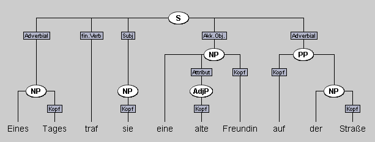



## Auswahl und Inhalt der Aufgaben

Dieses Aufgabenpaket zu Phrasen und syntaktischen Funktionen dient dazu, die
Identifikation von Phrasen und syntaktischen Funktionen einzuüben. Durch die
Repräsentation der Satzanalysen als Bäume in Synpathy wird den Studierenden
dabei auch der hierarchische Aufbau von Sätzen und Phrasen nähergebacht. 
Außerdem hilft die Visualisierung dabei Phrasentypen von syntaktischen Funktionen zu unterscheiden, da beide im Programm formal unterschiedlich dargestellt werden (s. Abbildung unten).
Wie die Aufgaben mit Hilfe des Programmes Synpathy bearbeitet werden, wird in der
[Anleitung für Studierende]({{exercise.student_page}}) erklärt.

Den Aufgaben liegt keine spezifische Syntax-Theorie wie z.B. die Generative
Grammatik oder die Dependenzgrammatik zugrunde. Die verwendeten
Analysekategorien lehnen sich an die eher deskriptiven Kategorien der
Syntax-Einführung von Pittner/ Berman[^pittner_berman] an. Trotz ihrer
deskriptiven Natur sollten den Studierenden einige theoretische Grundannahmen
vertraut sein:

[^pittner_berman]: Karin Pittner & Judith Berman (2015): _Deutsche Syntax. Ein Arbeitsbuch._ 6. Auflage. Tübingen: narr-Verlag.
   
-   Folgende Phrasentypen werden unterschieden:
    -   NP
    -   PP
    -   AdjP
    -   AdvP
    -   S

-   Da der Status der VP im Deutschen umstritten ist, soll diese nicht als Phrase
    bestimmt werden. Es wird lediglich das finite Verb ausgezeichnet.

- Folgende syntaktische Funktionen (Satzglieder) werden unterschieden:
	- Subjekt
	- Akkusativobjekt
	- Dativobjekt
	- Adverbial
	- Prädikativ

- Phrasen sind hierarchisch strukturiert, so enthält beispielsweise eine PP immer eine NP. 

- Innerhalb von Phrasen werden die folgenden Funktionen unterschieden:
	- Attribut
    - Kopf

> Vgl. hierzu auch die Datei
> ["Tipps zur Bestimmung von Phrasen und syntaktischen Funktionen"](vorgehen-satzanalyse-synpathy.html),
> welche den Studierenden als Hilfestellung zum Lösen der Aufgaben
> bereitgestellt werden kann.

Die folgende Abbildung zeigt die Analyse eines Beispielsatzes mit den in der
Aufgabe verwendeten Kategorien in Synpathy.

## Nächste Schritte

- Um sich mit dem Aufgabenformat vertraut zu machen, empfehlen wir als nächsten Schritt die [Anleitung für die Studierenden]({{exercise.student_page}}) zu lesen.
- Danach schauen Sie sich bitte die Aufgabe selbst an. Öffnen Sie dazu die
  Dateien _syntax_aufgaben.tig_ und
  _syntax_features.xml_ aus dem Archiv
  [syntax_aufgabendateien.zip]({{exercise.exercise_file}}) mit
  Synpathy. Wie sie dies tun, steht in der [Technikanleitung für Studierende](../../../Annotationsprogramm/Synpathy/studierende-anleitung-synpathy.html).
 
> Wenn Sie inhaltliche Änderungen an der Aufgabe an der Aufgabe vornehmen
> wollen, finden Sie hierzu eine Anleitung im zweiten Teil der [Technikanleitung für Lehrende](../../../Annotationsprogramm/Synpathy/lehrende-anleitung-synpathy.html).

- Anschließend können Sie den Studierenden die Aufgabe zur Verfügung stellen. Wenn Sie keine inhaltlichen Änderungen durchgeführt haben, sind alle für die Studierenden notwendigen Dateien in der zip-Datei <a href="#" onClick="getZip(); return false">aufgabe.zip</a> zusammengestellt. Falls Sie Änderungen durchgeführt haben, muss das Paket entsprechend angepasst werden.
- Nachdem Sie die Lösungen der Studierenden erhalten haben, kann es mit der Auswertung losgehen. Alle notwendigen Informationen hierzu finden sich in der [Technikanleitung für Lehrende](../../../Annotationsprogramm/Synpathy/lehrende-anleitung-synpathy.html). 
