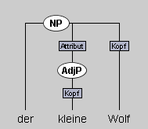
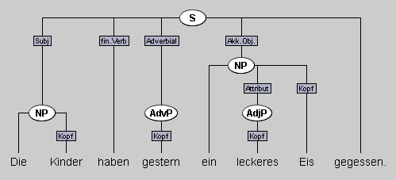




Bei der vorliegenden Aufgaben geht es darum, syntaktische Strukturen wie Phrasen
und Satzglieder zu bestimmen. Zur Bearbeitung nutzen Sie das Programm Synpathy.
Wie Sie das Programm installieren und die Aufgaben bearbeiten, können Sie in der
[Anleitung zu Synpathy]({{relative-baseurl}}{{site.data.programs.Synpathy.base_url}}{{site.data.programs.Synpathy.student_page}})
nachlesen.

Ihnen werden zwei Aufgabentypen begegnen:

- Entweder ist die Baumstruktur für Sie schon vorgegeben und Sie müssen nur die Phrasennamen und die Beschriftungen für die syntaktischen Kategorien ergänzen.
- Oder es geht darum, selbst Strukturbäume zu erstellen und anschließend die Beschriftungen hinzuzufügen. 

## Warum Synpathy? 

Mit Synpathy kann man die Struktur von Sätzen und Satzteilen leicht visualisieren. 
Die Phrase [der [kleine]AdjP Wolf]NP ließe sich in Synpathy z.B. folgendermaßen darstellen: 

Und den Satz *"Die Kinder haben gestern ein leckeres Eis gegessen"* könnte man so analysieren: 

- Die Visualierung kann dabei helfen, den Unterschied zwischen Phrasen und syntaktischen Funktionen im Satz sichtbar zu machen
    - Die ovalen Formen entsprechen hier Phrasen.
    - Die eckigen Formen zeigen an, welche Funktion die Phrasen im Satz übernehmen, also, ob es sich um Satzglieder oder Attribute handelt. 
    - Zusätzlich werden das finite Verb und die Phrasenköpfe als eckige Formen dargestellt.   
- An der Darstellung kann man zudem gut erkennen, wie Phrasen hierarchisch ineinander verschachtelt sind.
- Nicht zuletzt hoffen wir, dass es Ihnen auch ein bißchen Spaß bereitet, ein
  neues Programm kennenzulernen und Stück für Stück die Baumstrukturen zu erstellen.

Außerdem lassen sich Sätze, die Sie mit Synpathy analysiert haben, einfach durchsuchen und auswerten (vgl. die Hinweise in der [Anleitung zu Synpathy]({{relative-baseurl}}{{site.data.programs.Synpathy.base_url}}{{site.data.programs.Synpathy.student_page}})).

## Nächste Schritte

Zur Bearbeitung der Aufgabe benötigen Sie die folgenden Materialien:

- das Programm [Synpathy]({{relative-baseurl}}{{site.data.programs.Synpathy.download_url}})
- die Aufgabendatei _syntax\_aufgaben.tig_ und die Feature-Datei _syntax\_features.xml_. Diese finden
  Sie in dem zip-Archiv [syntax_aufgabendateien.zip]({{exercise.exercise_file}}).  
  Wichtig: Merken Sie sich, wohin Sie diese Dateien entpacken (z.B. auf dem
  Desktop), damit Sie diese später mit Synpathy öffnen können.

Die Benutzung von Synpathy wird in der
[Anleitung zu Synpathy]({{relative-baseurl}}{{site.data.programs.Synpathy.base_url}}{{site.data.programs.Synpathy.student_page}})
genau erklärt.

Eine zusätzliche inhaltiche Hilfestellungen zum Lösen der Aufgaben finden Sie in der Datei ["Vorgehen zur Satzanalyse"](vorgehen-satzanalyse-synpathy.html). 

