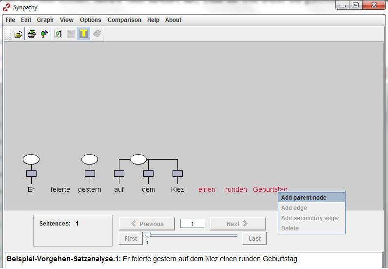
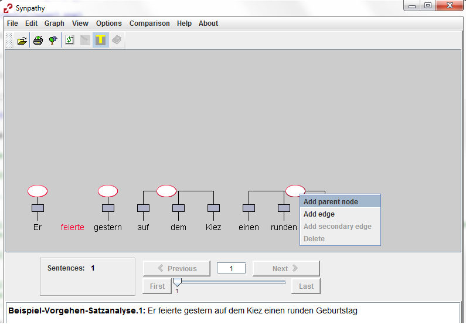
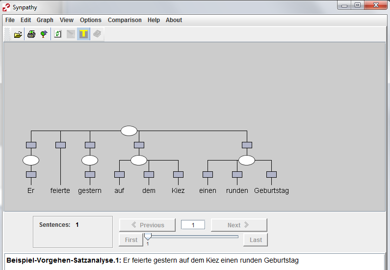
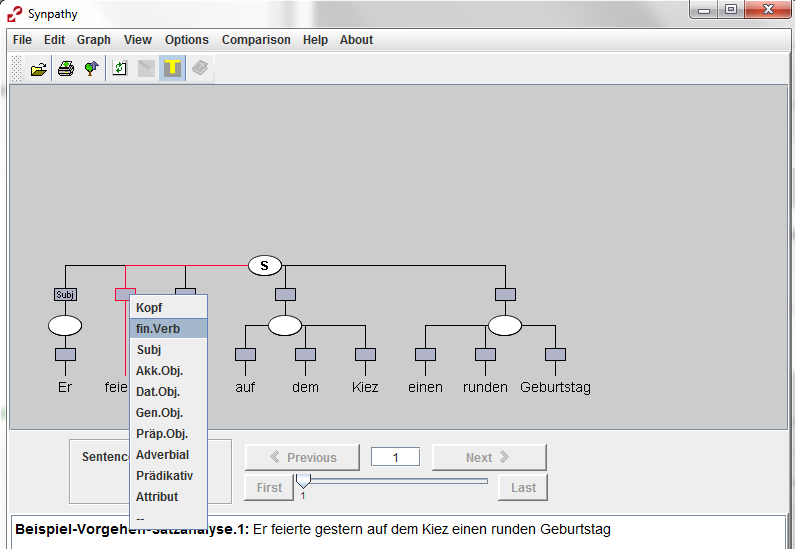
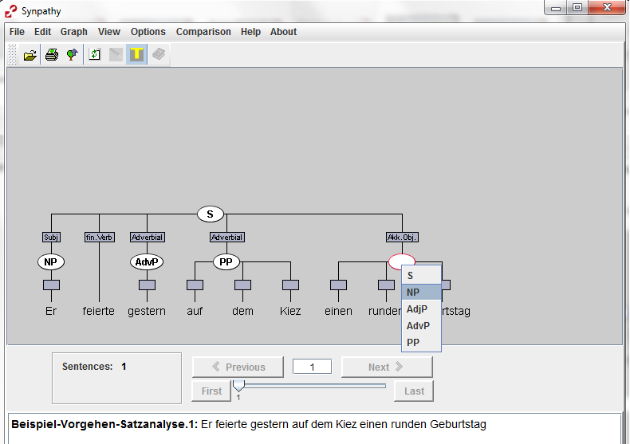
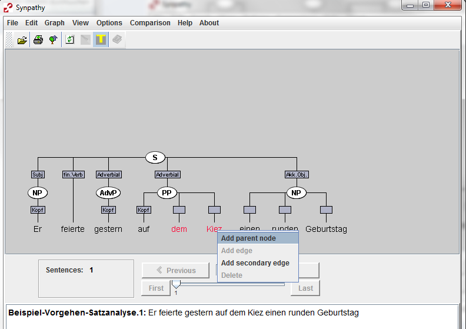
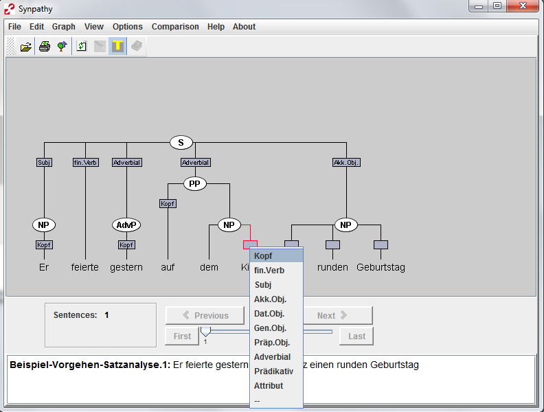
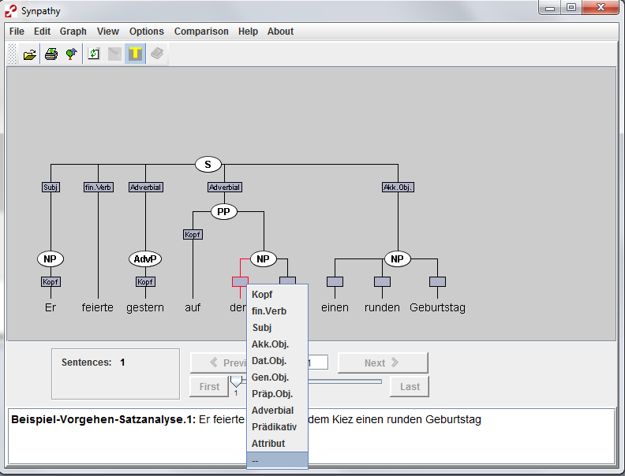
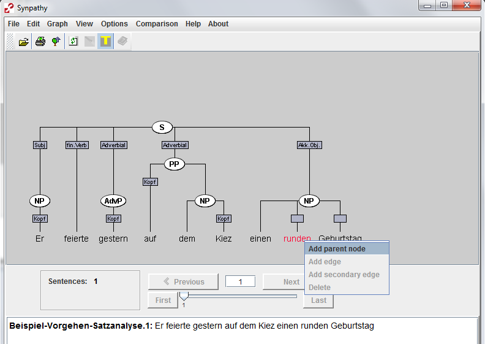
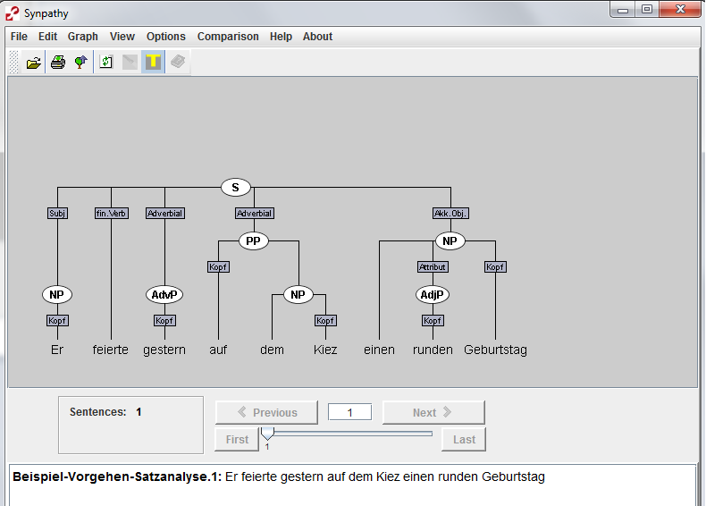

<a href="studierende-anleitung-syntax.html">Zur&uuml;ck zur &Uuml;bersicht</a>

# Vorgehen bei der Satzanalyse#

Dieses Dokument enthält Hinweise zum Vorgehen bei der Lösung
der Aufgabe. Es setzt voraus, dass Sie sich mit den Grundfunktionen von Synpathy
vertraut gemacht haben. Diese finden Sie in der [Anleitung zu Synpathy](../../../Annotationsprogramm/Synpathy/studierende-anleitung-synpathy.html).

1) Beginnen Sie die Analyse, indem Sie die unmittelbaren Konstituenten des
Satzes (Satzglieder) ausfindig machen. Erstellen Sie jeweils einen Knoten für
die einzelnen Konstituenten.

2)  Erstellen Sie nun den Satzknoten. Er besteht aus den unmittelbaren Konstituenten sowie
dem finiten Verb und (falls vorhanden) dem/den infiniten Verb(en). 

3) Beschriften Sie anschließen die Knoten und Kanten

- Der oberste Knoten stellt den Satz dar (S).
- Geben Sie bei den restlichen Knoten jeweils die Phrasenart an, z.B. NP, PP.
- Die Kanten, die vom Satz-Knoten ausgehen, werden mit den jeweiligen
  syntaktischen Funktionen ("Subjekt", "Akk.Obj.", "Adverbial" etc.) beschriftet. 
- Das finite Verb erhält das Label "fin.Verb".

4) Analysieren Sie nun die einzelnen Phrasen.

1.  Was ist der Kopf?  
    Beschriften Sie die Kante, die den Phrasen-Knoten mit ihrem Kopf verbindet
2.  Gibt es weitere eingebettete Phrasen?
    1.  Präpositionen sind immer die Köpfe von PPs und diese beinhalten immer eine NP, welche separat als solche markiert werden muss. 
    2. Substantive sind immer die Köpfe von NPs. Sie können mit Attributen z.B. in Form von AdjP oder NPs erweitert werden. Auch Pronomen sind Köpfe von NPs
    3. Adjektive und Adverbien bilden ebenfalls Köpfe von eigenen
            Phrasen (AdjP oder AdvP)
3.  Folgende Teile bleiben unbeschriftet (Label = "\-\-"):  
			(In-)Definitartikel oder Modifizierer wie *sehr*,
			NPs als Teile von PPs

**Beispiel:** 

*dem Kiez* ist fester Bestandteil der PP *auf dem Kiez* und *runden* ist
Attribut der NP *einen runden Geburtstag*. Mit Klammern würden die Phrasen
folgendermaßen ausssehen: [auf [dem Kiez]NP]PP und [einen [runden]AdjP Geburtstag]NP

Fertig!

