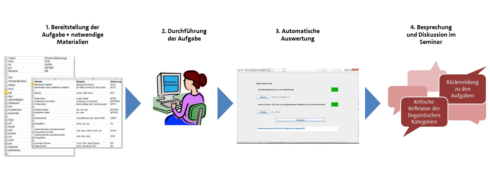




<b>Aufgaben</b>
<ul>

<li>{{category.name}}</li>
<ul>

<li><a href="{{relative-baseurl}}{{exercise.base_url}}{{exercise.teacher_page}}">{{exercise.name}}</a></li>

</ul>

</ul>
<b>Programme</b>
<ul>


{{ program[0] }}




<li><a href="{{relative-baseurl}}{{site.data.programs[program].base_url}}{{site.data.programs[program].teacher_page}}">{{program}}</a></li>

</ul>

# LEA - Linguistic Exercises with Annotation tools

## Herzlich Willkommen

LEA (_Linguistic Excercises with Annotation tools_) ist eine Sammlung von
Aufgaben für Studierende zu verschiedenen Bereichen des linguistischen
Grundwissens, die in Einführungsseminaren verwenden werden können. Das
Besondere an den Aufgaben ist, dass die Bearbeitung digital mit aktuellen
Annotationstools aus der Sprachwissenschaft erfolgt, d.h. mit in der Forschung
gängigen Programmen, die zur Anreicherung von Texten mit linguistischen
Informationen dienen. Leicht verständliche Anleitungen erläutern den Studierenden dabei
Schritt für Schritt den Umgang mit den Programmen. 

Neben der inhaltlichen Vertiefung des grammatischen Grundwissens werden die Studierenden durch die
Aufgaben mit aktuellen Tools und Standards zur
digitalen Aufbereitung von Sprachdaten vertraut gemacht, was ihnen neue
Möglichkeiten für eigene korpuslinguistische Arbeiten im Laufe des weiteren
Studiums eröffnet. Damit werden bereits in den Einführungen die Grundlagen für
korpuslinguistisches, forschendes Lernen gelegt. An diese Kompetenzen kann in
den Vertiefungs- und Schwerpunktmodulen des Studiums angeknüpft werden, so dass
die Verbindung von Einführungsseminar und Aufbau-/Vertiefungsseminaren
unterstützt wird. 

LEA bietet für Sie als Lehrenden zudem den Vorteil, dass die Lösungen
zu den Aufgaben automatisiert korrigiert und ausgewertet werden. Dadurch können
Sie Ihren Studierenden leicht Rückmeldungen geben und erhalten schnell einen
Überblick zum Wissensstand Ihrer Studierenden und können erkennen, bei welchen
linguistischen Kategorien noch Verständnisschwierigkeiten vorliegen.

Es existieren die folgenden Aufgabenpakete, die direkt nutzbar sind:



> Da die Annotations- und Auswertungsprogramme nicht auf die beigefügten
> Aufgaben beschränkt sind, können Sie bei Bedarf auch leicht eigene Aufgaben
> erstellen. Das Vorgehen wird in der Anleitung zum jeweiligen Programm
> erläutert.

## Paketaufbau

Die Aufgabenpakete sind immer mit der gleichen "Grundausstattung" versehen:

- einer Anleitung für Lehrende
- einer Aufgabe inklusive Musterlösung
- Anleitungen zum Annotationsprogramm
	- für Studierende
	- für Lehrende
- einem Paket (zip-Datei), mit allem was die Studierenden zur Bearbeitung der
  Aufgabe benötigen (Aufgabe und Anleitungen)

> Durch die Trennung von Anleitung zur Aufgabe und Anleitung zum
> Annotationsprogramm ist es möglich die Programmanleitung für unterschiedliche
> (ggf. zukünftige) Aufgaben, die mit dem selben Programm bearbeitet werden, zu
> verwenden. 

## Wie gelangt man zu den Aufgaben?

Alle benötigten Anleitungen und Dateien sind über Hyperlinks erreichbar, so dass Sie sich nicht durch die Ordnerstruktur klicken müssen, sondern von dieser Seite ausgehend alles erreichen. 

Die einzelnen Aufgaben finden Sie oben auf der Seite verlinkt.
Die Links führen zur Anleitung für Lehrende. Dort werden alle weiteren Schritte erklärt und alle notwendigen Dateien sind hier verlinkt.

> Um Doppelungen zu vermeiden, wird die Nutzung des Programms zur Bearbeitung
> einer Aufgabe (z.B. wie wird eine Datei mit dem Programm geöffnet) nur in der
> Anleitung für Studierende erläutert.  
> Die Anleitung für Lehrende erläutert die zusätzlichen Funktionen für die
> automatische Auswertung der studentischen Lösungen und gibt Hinweise, wie
> eigene Aufgaben erstellt werden können. Es wird daher empfohlen beide
> Anleitungen zu lesen.

  
## Einbindung in den Unterricht

Die LEA-Pakete beinhalten E-Learning-Aufgaben, die die Studierenden im
Selbststudium am heimischen PC lösen können. Es ist aber auch denkbar, dass die
Studierenden die Aufgaben in einem IT-Pool im Rahmen der Tutoriums nutzen. Im
Folgenden geben wir Ihnen Hinweise, wie die Pakete in den Unterricht eingebunden werden können.

### Technische und inhaltliche Voraussetzungen 

Die Aufgaben sind inhaltlich so konzipiert, dass mit ihnen Inhalte aus dem
Seminar wiederholt und vertieft werden können. So setzt das Aufgabenpaket
"Syntax" bspw. voraus, dass im Unterricht bereits Phrasen und syntaktische
Funktionen behandelt wurden. Die jeweilige Anleitung zum Paket gibt Ihnen
Informationen darüber, welches Wissen bei den Studierenden vorausgesetzt wird.

Technisches Wissen wird grundsätzlich nicht vorausgesetzt.
Die zur Aufgabe benötigten Programme sind entweder auf den meisten Computern
bereits installiert (z.B. ein Tabellenkalkulationsprogramm wie LibreOffice Calc
oder Microsoft Excel), Bestandteil des Pakets oder können leicht heruntergeladen
werden und benötigen keine Installation.

> Die Annotationsprogramme sind so ausgewählt, dass Sie auf allen gängigen
> Computern lauffähig sind. Die vorhandenen Pakete wurden bereits unter Windows
> und Mac getestet. Die Anleitungen beziehen sich bislang allerdings nur auf
> Windows.

### Ablauf

Die folgende Übersicht illustriert, wie eine Aufgabe (am Beispiel eines LEA-Pakets
zu "Wortarten") von den Studierenden bearbeitet wird.

Für die einzelnen Phasen haben Sie unterschiedliche Möglichkeiten:

- Bereitstellung der Aufgabe + notwendige Materialien
	- kann per Mail erfolgen oder
	- indem die Materialien auf einer Lernplattform zur Verfügung gestellt werden
- Durchführung der Aufgabe (alleine oder zu zweit)
	- als Hausaufgabe oder
	- als Aufgabe innerhalb von Seminarbegleitenden Tutorien (falls vorhanden)
- Automatische Auswertung
	- die Studierenden schicken Ihnen Ihre Lösungsdatei per Mail zu  oder
    - laden sie bei einer Lernplattform hoch oder
    - speichern sie an einem vereinbarten Ort auf einem Netzlaufwerk ab.
	- Haben Sie alle Lösungen beisammen, können Sie die Korrektur und Auswertung
      automatisch über ein Auswertungsprogramm durchführen.
- Besprechung der Aufgabe 
	- die Studierenden erhalten eine korrigierte Version ihrer Aufgaben per
      Mail und/ oder
    - Sie besprechen häufige Fehler, die durch das Auswertungstool einfach
      erkennbar sind, im Seminar.
    - zusätzlich können Sie den Studierenden die Musterlösungen, die Sie für die Auswertungstools
      verwendet haben, zur Verfügung stellen
    
> Tipp: Anonymisierte Auswertung  
>  Eine dritte Person (z.B. eine Tutorin/ ein Tutor) erhält die Lösungen der
>  Studierenden und weist ihnen eindeutige Zahlen-/Buchstabenkombinationen zu,
>  bevor die Lösungen an Sie weitergeleitet werden.
>  Nach der Auswertung ordnet diese Person die Lösungen wieder den Studierenden zu.

Mit einem Klick auf einen der folgenden Aufgaben kann es losgehen.



## Mitwirkende

LEA wurde erdacht und entwickelt von Fabian Barteld und Johanna Flick.

Ein erster Prototyp wurde mit einer Förderung des "Innovationsfonds
Studium und Lehre" der Fakultät für Geisteswissenschaften an der
Universität Hamburg unter Mitarbeit von Christiane Höltmann und Alexandra Lindt
erstellt. Im Sommersemester 2016 und im Wintersemester 2016/2017 wurde dieser
Prototyp in Einführungen in die germanistische Linguistik an der Universität
Hamburg evaluiert. Wir möchten allen Lehrenden und Studierenden danken, die an
der Evaluationsphase teilgenommen haben: Melanie Andresen, Yvonne Hettler,
Eleonore Schmitt, Renata Szczepaniak, Annika Vieregge und Heike Zinsmeister.

